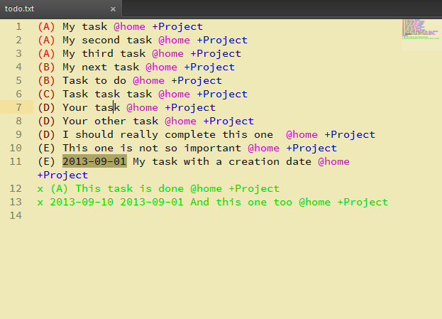
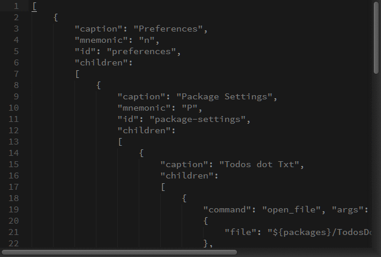
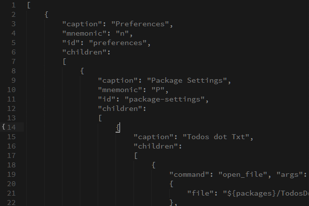

Todos.txt Sublime Text 3 integration
====================================

Description
-----------

A ST3 plugin to manipulate a todo.txt file (as defined by the Todo.Txt application).

Features
--------

All shortcuts includes the ø character, which corresponds to *ctrl* on Windows and Linux and *cmd* on OSX.

### Custom color scheme and syntax highlighting

A todo.txt file has a different color scheme than other files in order to distinguish your todo lists from your usual files.

### Todos.txt file manipulations

#### Priority management

- You can decrease the priority of a task by hitting ^+m ø+p over the corresponding line,
- You can increase the priority of a task by hitting ø+m ø+o over the corresponding line

#### Sorting tasks

You can sort all your tasks by simply hitting ø+m ø+s inside your todo.txt file. The sort order is :
- The task is done or not
- The task priority 

### Todos.txt add shortcut

You can add a new task to your todo.txt file from anywhere in ST3 by hitting ø+m ø+a.

### Todos.txt search shortcut

You can search for tasks in a ST3 search popup by hitting ø+m ø+f.

Usage
-----

Except for the add and search shortcuts, TodosDotTxt should work out of the box once installed with Package
Control or by cloning this repository.
If you'd like to get shortcuts to work, you need to open your TodosDotTxt user settings and add the path to
your main todo.txt file.
